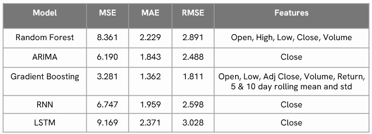

# Stock Price Predictor

## Overview

The **Stock Price Predictor** is a machine learning-based project designed to predict the daily closing price of Google (GOOG) stock. Using historical stock market data, it applies multiple models to identify trends, analyze relationships, and provide predictions to assist retail investors in decision-making.

## Dataset

- **Source**: Yahoo Finance
- **Period**: August 8, 2004 – February 9, 2024
- **Frequency**: Daily
- **Features**: Date, Open, High, Low, Close, Adjusted Close, Volume
- **Rows**: 4902
- **Transformations**:
  - Normalization
  - Log Transformation
  - Standard Scaling
- **Train-Test Split**: 90:10

## Models Implemented

### 1. Random Forest Regression

- **Algorithm**: Ensemble learning using decision trees.
- **Hyperparameters**:
  - `n_estimators`: 400
  - `max_features`: 'sqrt'
  - `max_depth`: None

### 2. ARIMA

- **Algorithm**: Auto-Regressive Integrated Moving Average, optimized for time-series data.
- **Hyperparameters**:
  - `p`: 1, `d`: 1, `q`: 0 (selected using auto_arima).

### 3. Gradient Boosting

- **Algorithm**: Iterative ensemble learning minimizing residual error.
- **Hyperparameters**:
  - Tuned using Optuna

### 4. Recurrent Neural Networks (RNN)

- **Algorithm**: Sequential data learning using gradient descent.
- **Hyperparameters**:
  - Optimizer: RMSprop
  - Activation: tanh
  - Epochs: 35
  - Batch Size: 40

### 5. Long Short-Term Memory (LSTM)

- **Algorithm**: RNN variant addressing vanishing/exploding gradients.
- **Hyperparameters**:
  - Optimizer: Adam
  - Loss: Mean Squared Error
  - Epochs: 50
  - Batch Size: 32

## Key Findings

- **Best Model**: Gradient Boosting with rolling mean/std transformations.
- **Worst Model**: LSTM due to high computational cost and shifted predictions.
- ARIMA works well for short-term predictions but struggles long-term.
- RNN models faced challenges with long-term dependencies.

## Limitations

- Dataset limited to Google stock; generalization to other stocks untested.
- Exclusion of macroeconomic indicators (e.g., market news, employment rates).
- Absence of high-frequency data (e.g., tick-level).

## How to Run

1. Clone the repository.
2. Install dependencies from `requirements.txt`.
3. Run each Jupyter Notebook in the following order:
   - `Data_Collection.ipynb`
   - `Data_Exploration.ipynb`
   - Model notebooks (`ARIMA.ipynb`, `Random_Forest.ipynb`, `XGBoosts.ipynb`, `RNN.ipynb`, `LSTM.ipynb`)
4. Review model performance comparisons in the included `Report.pptx`.

## License

Copyright © 2024 [Ryan Sun] (https://github.com/Ryii). 
This project is [MIT](https://github.com/Ryii/Options-Trading-Analysis/blob/main/LICENSE.md) licensed.
